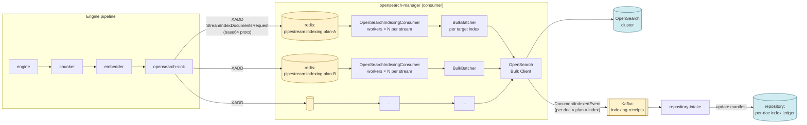
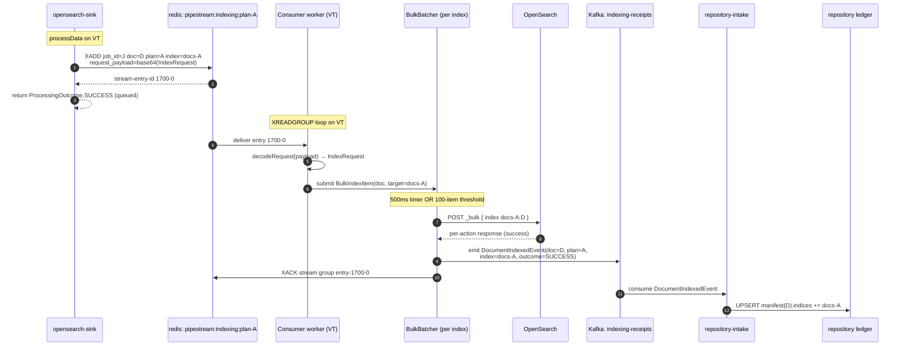

# OpenSearch Indexing — Redis-Decoupled Design (Phase 2)

**Status:** Draft v3.1 (B1 implementation pass surfaced topic-naming + plugin-config corrections)
**Owners:** kr (architect)
**Companion code:** sink-side Phase 1 landed at `opensearch-sink-pr0@f784c07`
**Scope:** opensearch-manager consumer, bulk-batching, receipt emission, repository ledger
**Out of scope:** GPU/cuVS HNSW acceleration, Lucene-direct sideloading, multi-region OS

### v3.1 changes (B1 implementation reality-check)

Three corrections surfaced while landing B1. Tightening, not architecture:

1. **Topic name aligned with platform convention** — was
   `pipestream.indexing.receipts`, now bare `indexing-receipts`.
   Existing platform topics (account-events, repository-events,
   drive-updates) are all bare. The auto-config in
   `quarkus-apicurio-registry-protobuf` strips the `-out`/`-in` suffix
   from the channel name to derive the topic; both ends converge on
   `indexing-receipts` without either side hardcoding it.
2. **§4.3 sketch corrected to use `@ProtobufChannel` + `ProtobufEmitter`**
   — the canonical injection per the extension README. The plain
   `@Channel` + `Emitter` shape works (backward-compat scanner path)
   but is not the documented pattern.
3. **Explicit "no `mp.messaging.outgoing.*.connector`/`.topic` overrides"
   call-out** added — adding those redundant lines is exactly the
   "prevents the plugin from kicking in" trap. The extension's
   auto-configuration is the whole point.

### v3 changes (post-Gemini + big-bang migration)

Four tightenings from Gemini's pass, plus a structural simplification of the
migration plan once we acknowledged the old path is broken, not "working but
sensitive":

1. **§4.4 ULID minting location**: explicitly mint at *outcome-materialization*
   (the moment the dispatcher's future resolves with a `BulkOutcome`), not
   at receipt-emit time. The two are usually one stack frame apart, but
   the rule matters for stragglers that queue inside the kafka emitter.
2. **§4.6 orphaned-stream metric**: micrometer gauge for "streams with no
   matching plan in registry but still draining" so the discovery loop's
   cleanup behavior is observable.
3. **§4.2 null-defense in the Mutiny bridge**: explicit handling of a
   `Uni<Void>` or `Uni<null>` completion from a strategy so the
   `CompletableFuture` doesn't get a null `BulkOutcome` it then NPEs on.
4. **§5 / §4.1 poison-and-ledger pairing made explicit**: every poison-stream
   move emits a `FAILED_TERMINAL` receipt *before* the XACK. The v2 dispatch
   already did this in code; v3 calls it out in prose so reviewers see the
   invariant without tracing the lambda.
5. **§8 migration simplified from 3 PRs to 2 (big-bang)**: the old sink→manager
   bidi path is failing 582 times per run today and nothing in production
   depends on it. There's nothing to preserve. We delete the bidi code in
   the same PR that lands the consumer, with a `consumer-enabled` kill-switch
   config for operational rollback (stop draining while investigating)
   instead of a migration feature flag.

### v2 changes from v1 (preserved for reviewers comparing against v1)

Seven tightenings from the first critique pass — all implementation
traps or proto gaps, no architecture changes:

1. §4.1 explicit reader-thread vs worker-thread contract; reader never blocks
   on `inFlight`, uses non-blocking `tryAcquire` with backoff.
2. §4.1 `dispatch` rewritten so every error path maps unambiguously to a §5
   failure-matrix row (no implicit "retryable vs terminal" decision in the
   pseudocode).
3. §4.4 receipt proto: `OUTCOME_PARTIAL_SUCCESS` + `repeated IndexOutcome
   sub_outcomes` for chunked strategies where one bulk response can have
   per-action mixed results.
4. §4.5 ledger UPSERT made strictly monotonic: ULID `attempt_id`, write
   ignored if `attempt_id <= last_attempt_id` lexicographically.
5. §4.6 (new) stream/plan lifecycle: orphan worker-pool shutdown when a
   plan is deleted from the plan registry.
6. §10 Q3 third option added: block-with-timeout XADD for sink-side
   backpressure.
7. §3 sequence diagram footnote: kafka partition-skew note + compound
   `(account_id, doc_id)` key as the escape hatch for hot accounts.

---

## 1. Why we're rewriting this path

Today the engine pipeline dispatches each document through:

```
engine → embedder → opensearch-sink (gRPC) → opensearch-manager (Mutiny bidi) → OpenSearch bulk
```

The sink↔manager hop is a long-lived bidi gRPC stream wrapped in Mutiny. At
moderate fan-out (1000 docs across multiple plans), the manager-side Mutiny
chain emits `BackPressureFailure - Cannot emit item due to lack of requests`
which bubbles back to the sink as `StatusRuntimeException: UNKNOWN`. Once any
`processData` call gets this exception, the engine's `HANDOFF` status flips
to failure, and the whole doc gets failed across all plans even when most of
them would have indexed cleanly. The current run produced **582 such errors**
on a single 1000-doc crawl.

The deeper problem isn't the specific Mutiny operator — it's that we're using
a synchronous transport (gRPC bidi) to carry an inherently asynchronous workload
(bulk indexing batches that take 50–500 ms each). The sink's `processData`
deadline is bounded by the engine's HANDOFF expectation (sub-second), but
the manager's OpenSearch bulk write isn't. That mismatch is what generates
the back-pressure failure: the manager wants to slow down, gRPC has no
mechanism to tell the sink to slow down, so Mutiny refuses to emit and the
call errors instead.

The fix is to make the asynchrony explicit. The sink hands off to a redis
stream and is done. The manager drains that stream at its own pace. Bulk
durability comes back to the engine asynchronously as a Kafka receipt event.
HANDOFF success at the sink means *"transformed and queued"*; **end-to-end
OpenSearch durability lives in the repository's per-doc index manifest**,
fed by the receipt topic.

---

## 2. End-state architecture



Three persistence boundaries, three independently scalable stages:

1. **Sink → redis indexing streams.** Backpressure ceiling is `stream-maxlen`
   per plan. If OpenSearch can't keep up, streams fill, XADDs at the sink
   start trimming oldest entries (or block, configurable). The pipeline above
   the sink continues unaffected — *the sink is no longer in the critical
   path of OpenSearch durability*.
2. **Redis streams → manager consumers → OpenSearch bulk.** Throughput is owned
   by the OS bulk endpoint; the consumer pool is sized to saturate it without
   overcommitting (typically 4–8 workers per stream, 2–4 partitions per plan).
3. **Bulk ACK → Kafka receipts → repository ledger.** The ledger is the
   authoritative source of "doc X is in indices [A, B, C], failed on D, last
   updated T". Every query asking "is this doc indexed?" hits the ledger,
   not OpenSearch.

---

## 3. Sequence diagram (single doc, single plan, happy path)



The key design point: **the receipt is emitted before the XACK**. If we crash
between bulk ACK and receipt emit, the entry stays in PEL, gets reclaimed by
XAUTOCLAIM, the bulk gets retried (idempotent — same doc id), and the receipt
emits on the retry. If we crash between receipt emit and XACK, same thing —
the receipt was already emitted, and the retry's receipt is a duplicate that
the repository deduplicates by (doc_id, plan_id, attempt_id). At-least-once
on both legs, deduplicated at the ledger.

---

## 4. Component design

### 4.1 OpenSearchIndexingConsumer

Mirrors the shape of the engine's `RedisEdgeConsumer` we just landed, with
two differences: (a) the stream key set is `pipestream:indexing:<plan_id>`
rather than `pipestream:edge:...`, and (b) on success it routes to the bulk
batcher rather than directly XACKing on its own.

#### Thread contract

There are three thread populations per stream and they have **different** rules:

| Population | Count | Blocking allowed? | Owns what |
|---|---|---|---|
| Reader VT | 1 per stream | yes — only on `XREADGROUP BLOCK` | reading messages off redis |
| Dispatcher VT pool | `workersPerStream` (default 8) | yes — on bulk batch flush | calling `dispatcher.handle()` per message |
| Reclaim VT | 1 per stream | no | periodic `XAUTOCLAIM` for stalled PEL entries |

The reader **never blocks on `inFlight`**. If the inFlight semaphore is at
its ceiling (i.e. dispatcher pool is saturated), the reader **stops calling
XREADGROUP and sleeps with backoff**. This is the correct backpressure
signal to redis: messages stay on the stream, deliveries stop, PEL doesn't
grow with un-dispatchable work. The `tryAcquire` + sleep loop is what makes
this safe:

```java
private void readerLoop(StreamKey key) {
    while (running) {
        // Don't even read if we can't dispatch what we'd read. Sleep then
        // re-check — never block holding a redis connection in XREADGROUP
        // while the dispatcher pool is full.
        if (inFlight.availablePermits() <= 0) {
            sleepWithBackoff();
            continue;
        }
        int budget = Math.min(readBatchSize, inFlight.availablePermits());
        List<StreamMessage<String,String,String>> messages =
            streams.xreadgroup(group, consumerName(key, "reader"),
                Map.of(key.toString(), ">"),
                XReadGroupArgs.Builder.block(blockMs).count(budget));
        for (var msg : messages) {
            // tryAcquire is non-blocking; budget above guarantees success
            // unless a concurrent reclaim grabbed permits, in which case
            // we requeue this message via leave-in-PEL semantics (no ACK).
            if (!inFlight.tryAcquire()) {
                LOG.warnf("inFlight race; leaving msg %s pending for reclaim", msg.id());
                continue;
            }
            dispatcherPool.submit(() -> dispatch(key, msg));
        }
    }
}
```

The reclaim VT runs `XAUTOCLAIM` on a separate cadence (every
`pending-idle-ms` ÷ 4 or so) and submits reclaimed messages through the
same `dispatch` path. It also `tryAcquire`s; permits exhausted means we
skip this reclaim tick — the entry stays in PEL and gets another chance.

#### Dispatch (aligned to §5 matrix)

```java
@ApplicationScoped
@Startup
public class OpenSearchIndexingConsumer {

    @Inject RedisDataSource redis;
    @Inject IndexingStrategyDispatcher dispatcher;
    @Inject IndexingReceiptEmitter receipts;

    @ConfigProperty(name = "pipestream.opensearch-manager.indexing.workers-per-stream",
            defaultValue = "8")
    int workersPerStream;

    @ConfigProperty(name = "pipestream.opensearch-manager.indexing.max-in-flight-per-stream",
            defaultValue = "64")
    int maxInFlightPerStream;

    @ConfigProperty(name = "pipestream.opensearch-manager.indexing.pending-idle-ms",
            defaultValue = "30000")
    long pendingIdleMs;

    @ConfigProperty(name = "pipestream.opensearch-manager.indexing.max-delivery-count",
            defaultValue = "5")
    int maxDeliveryCount;

    /**
     * Process one redis-stream message. Permit is acquired by the caller
     * (reader or reclaim VT); always released in the finally so a stuck
     * dispatch cannot starve the inFlight semaphore.
     *
     * <p>Disposition rules map 1:1 to §5 failure matrix; no other code path
     * decides ACK semantics:
     * <ul>
     *   <li>delivery_count ≥ max → poison + ACK + TERMINAL receipt</li>
     *   <li>malformed payload → poison + ACK + TERMINAL receipt</li>
     *   <li>strategy success (incl. partial) → ACK + receipt (SUCCESS or PARTIAL_SUCCESS)</li>
     *   <li>strategy terminal failure (mapping conflict, etc.) → ACK + TERMINAL receipt</li>
     *   <li>strategy transient failure (5xx, 429, network) → NO ACK + RETRYING receipt</li>
     *   <li>strategy threw uncaught → NO ACK + RETRYING receipt (treated as transient)</li>
     * </ul>
     */
    private void dispatch(StreamKey key, StreamMessage<String,String,String> msg) {
        Disposition disposition = Disposition.RETRY;  // safe default: leave pending
        DocumentIndexedEvent receipt = null;
        try {
            if (msg.deliveryCount() >= maxDeliveryCount) {
                receipt = receiptTerminalDeliveryExceeded(msg);
                poison(key, msg);
                disposition = Disposition.ACK;
                return;
            }
            StreamIndexDocumentsRequest req;
            try {
                req = OpenSearchIndexingPublisher.decodeRequest(
                        msg.payload().get("request_payload"));
            } catch (IllegalArgumentException malformed) {
                receipt = receiptTerminalMalformed(msg, malformed);
                poison(key, msg);
                disposition = Disposition.ACK;
                return;
            }

            BulkOutcome outcome = dispatcher.handle(req).future().join();
            receipt = receiptFromOutcome(req, msg, outcome);
            disposition = switch (outcome.classification()) {
                case SUCCESS, PARTIAL_SUCCESS, TERMINAL_FAILURE, SKIPPED -> Disposition.ACK;
                case TRANSIENT_FAILURE -> Disposition.RETRY;
            };
        } catch (Throwable uncaught) {
            // Uncaught == transient by policy. If it's actually a bug, the
            // delivery_count check above will eventually convert it to
            // TERMINAL via the poison path.
            receipt = receiptTransient(msg, uncaught);
            disposition = Disposition.RETRY;
        } finally {
            try {
                if (receipt != null) {
                    receipts.emit(receipt);   // receipt-before-ACK; see §3
                }
                if (disposition == Disposition.ACK) {
                    ack(key, msg);
                }
                // RETRY: do nothing; PEL retains the entry, XAUTOCLAIM reclaims.
            } finally {
                inFlight.release();
            }
        }
    }

    private enum Disposition { ACK, RETRY }
}
```

**Why every error path is explicit:** the v1 sketch's `whenComplete` left the
ACK/no-ACK decision in the lambda's branching, which made it possible to
ship an "implicitly retryable" error without a §5 row to back it up. The v2
shape forces every disposition through the `switch (classification())` and
the `Disposition` enum, so a new failure mode that doesn't have a §5 entry
won't compile until we add one.

**Key design decisions in this class:**

- **Stream discovery is dynamic via SCAN, not config.** Adding a new plan in
  the admin UI requires no manager redeploy — the sink starts XADD'ing to a
  new stream key, the manager's discovery loop notices on its next scan
  (5–10 s cadence), spawns the worker pool. This is the same way the engine's
  `RedisEdgeConsumer.discoverEdgeStreams()` works today.
- **`maxInFlight` is per-stream**, not global. A heavy plan can saturate its
  own workers without starving a light plan's workers.
- **Receipt emission is *not* gated on XACK.** Receipt fires once the bulk
  batch resolves; XACK fires after receipt is on the wire. See §3 for why
  the receipt-first ordering is correct.
- **`inFlight.release()` is unconditional** in the `finally`. Any path that
  acquires a permit must release it — including the malformed-payload path,
  including the uncaught-exception path. A permit leak here would silently
  shrink the dispatcher's effective concurrency until restart.

### 4.2 IndexingStrategyDispatcher

Bridges the existing `IndexingStrategyHandler` (Mutiny) to the consumer's
blocking-VT world *without* dragging the BackPressureFailure back in. The
dispatcher converts each strategy's `Uni<...>` chain into a
`CompletableFuture<BulkOutcome>` that completes when the relevant bulk batches
have ACK'd. The strategy classes don't have to be rewritten in Phase 2 —
just adapted at the seam.

```java
@ApplicationScoped
public class IndexingStrategyDispatcher {

    @Inject NestedIndexingStrategy nested;
    @Inject ChunkCombinedIndexingStrategy chunkCombined;
    @Inject SeparateIndicesIndexingStrategy separateIndices;

    DispatchOutcome handle(StreamIndexDocumentsRequest req) {
        IndexingStrategyHandler handler = switch (req.getIndexingStrategy()) {
            case INDEXING_STRATEGY_UNSPECIFIED, INDEXING_STRATEGY_NESTED -> nested;
            case INDEXING_STRATEGY_CHUNK_COMBINED -> chunkCombined;
            case INDEXING_STRATEGY_SEPARATE_INDICES -> separateIndices;
            default -> throw new IllegalArgumentException("unknown strategy");
        };
        IndexDocumentRequest indexRequest = adapt(req);
        // Bridge: subscribe the Uni, complete the CF on terminal events.
        // The Uni still runs Mutiny internally but we never block any caller
        // on it — the consumer worker is event-driven via the future.
        CompletableFuture<BulkOutcome> cf = new CompletableFuture<>();
        handler.indexDocument(indexRequest)
            .subscribe().with(
                resp -> {
                    // Defensive: a strategy could in principle return a
                    // Uni<Void>-like null completion. Mutiny treats null
                    // as a valid emission; we treat it as a TERMINAL
                    // contract violation because BulkOutcome is required
                    // downstream and a null would NPE the dispatcher's
                    // classification switch. Surfacing it as a terminal
                    // failure makes the bug visible in the receipt rather
                    // than as an uncaught throwable on the worker VT.
                    if (resp == null) {
                        cf.complete(BulkOutcome.terminal(
                                "strategy returned null IndexDocumentResponse "
                                + "(contract violation: strategy=" + handler.getClass().getSimpleName() + ")"));
                        return;
                    }
                    cf.complete(toBulkOutcome(resp));
                },
                err -> cf.completeExceptionally(err));
        return new DispatchOutcome(cf);
    }
}
```

**Phase 2 deliberately keeps the Mutiny-internal strategy code.** Ripping
Mutiny out of `ChunkCombinedIndexingStrategy` is a known-good follow-up
but isn't on the critical path for getting end-to-end working. Once the
consumer is event-driven, the BackPressureFailure goes away: there's no
gRPC bidi stream caller to violate the subscriber contract anymore — the
only subscriber is our internal `CompletableFuture` glue, which always
requests `Long.MAX_VALUE`.

### 4.3 IndexingReceiptEmitter

```java
@ApplicationScoped
public class IndexingReceiptEmitter {

    @Inject
    @ProtobufChannel("indexing-receipts-out")
    ProtobufEmitter<DocumentIndexedEvent> emitter;

    public void emit(DocumentIndexedEvent event) {
        // The IndexingReceiptKeyExtractor (sibling @ApplicationScoped
        // bean) is auto-discovered by the apicurio-protobuf extension
        // and mints the UUID partition key as UUID.nameUUIDFromBytes(doc_id),
        // throwing on empty doc_id (no random-UUID or magic-string
        // fallback per the platform's no-implicit-state rule).
        emitter.send(event).toCompletableFuture().join();
    }
}
```

Wire-level details — both auto-configured by
`quarkus-apicurio-registry-protobuf` from the `@ProtobufChannel`
injection point and from the consumer side's `@Incoming` binding:

- Channel `indexing-receipts-out` → topic `indexing-receipts` (strip `-out`)
- Channel `indexing-receipts-in` on the repository side → same topic (strip `-in`)
- Key: UUIDv5 of `doc_id` from `IndexingReceiptKeyExtractor`
- Value: protobuf via `ProtobufKafkaSerializer` / `ProtobufKafkaDeserializer`

**Neither side configures `connector` or `topic` in
`application.properties`** — the extension's auto-config covers it.
Adding those lines is the classic "prevents the plugin from kicking
in" trap; the only thing `application.properties` needs to know is
the Apicurio registry URL in `%prod` (DevServices auto-sets it in
dev/test).

Per-doc ordering means the repository ledger never sees a stale
`failed` land after a `success` for the same (doc, plan, index).

### 4.4 Receipt proto

```proto
// In: pipestream-protos/repo/proto/ai/pipestream/repository/v1/indexing_receipts.proto

syntax = "proto3";
package ai.pipestream.repository.v1;

import "google/protobuf/timestamp.proto";

message DocumentIndexedEvent {
  // The pipeline document this receipt is for.
  string doc_id = 1;
  string account_id = 2;
  string datasource_id = 3;

  // What was attempted at the (plan, index) level. For CHUNK_COMBINED and
  // SEPARATE_INDICES strategies one logical "index this doc" produces
  // writes to MULTIPLE physical indices (base + chunk indices); the
  // top-level outcome aggregates and sub_outcomes carries the detail.
  string plan_id = 4;
  string index_name = 5;
  string crawl_id = 6;

  // Aggregate outcome across all physical index writes for this (doc, plan).
  // SUCCESS = every physical index write returned OK.
  // PARTIAL_SUCCESS = at least one succeeded, at least one failed terminally.
  //                   sub_outcomes carries the per-index detail.
  // FAILED_TERMINAL = manager gave up (max-delivery or non-retryable error
  //                   on every physical index).
  // FAILED_RETRYING = transient failure, manager will retry. Informational.
  // SKIPPED = strategy intentionally produced no writes (e.g. doc had no
  //           body for semantic processing). Repository should treat
  //           SKIPPED as a terminal "nothing-to-index" state, NOT as
  //           failure.
  enum Outcome {
    OUTCOME_UNSPECIFIED = 0;
    OUTCOME_SUCCESS = 1;
    OUTCOME_FAILED_TERMINAL = 2;
    OUTCOME_FAILED_RETRYING = 3;
    OUTCOME_SKIPPED = 4;
    OUTCOME_PARTIAL_SUCCESS = 5;
  }
  Outcome outcome = 7;
  string failure_reason = 8;  // empty unless outcome ∈ {FAILED_*, PARTIAL_SUCCESS}

  // Per-physical-index detail. ALWAYS populated for chunked strategies
  // (CHUNK_COMBINED, SEPARATE_INDICES). Empty for the NESTED strategy
  // where a single (doc, plan) maps to a single physical index — in that
  // case the top-level outcome alone is authoritative.
  repeated IndexOutcome sub_outcomes = 12;

  // Attempt correlation. attempt_id is a ULID minted at
  // OUTCOME-MATERIALIZATION time — i.e. the instant the manager classifies
  // the bulk response into a BulkOutcome — NOT at kafka-emit time. The
  // two are usually adjacent stack frames, but if the kafka emitter is
  // backed up the emit timestamp can lag by seconds while a parallel
  // worker's earlier outcome is still queuing; minting at materialization
  // keeps the ULID's lexicographic order aligned with real delivery
  // order. The repository UPSERT ignores any write whose attempt_id is
  // ≤ the row's last_attempt_id — that's how we stay monotonic under
  // at-least-once redelivery from the receipt topic AND from
  // XAUTOCLAIM-driven retry of the redis indexing stream.
  string attempt_id = 9;  // ULID
  int32 delivery_count = 10;  // matches redis PEL deliveryCount at outcome time

  google.protobuf.Timestamp emitted_at = 11;
}

message IndexOutcome {
  // Physical OpenSearch index name (parent or chunk-specific).
  string index_name = 1;
  // Per-physical-index outcome. SUCCESS / FAILED_TERMINAL / FAILED_RETRYING
  // / SKIPPED — same semantics as the top-level enum but at finer grain.
  DocumentIndexedEvent.Outcome outcome = 2;
  string failure_reason = 3;
  // For chunked strategies, how many bulk actions targeted this index.
  // Lets the repository show "doc D landed 47 chunks in index X" without
  // needing per-chunk receipts.
  int32 action_count = 4;
  // Of those, how many succeeded. action_count == success_count ⇒ SUCCESS;
  // 0 < success_count < action_count ⇒ PARTIAL_SUCCESS at top level.
  int32 success_count = 5;
}
```

Things worth calling out:

- **`PARTIAL_SUCCESS` is needed for chunked strategies.** One bulk request to
  OpenSearch can produce mixed per-action results (e.g. 46 chunks indexed,
  1 chunk rejected for a field-length violation). Without `PARTIAL_SUCCESS`
  the repository ledger would either lie ("SUCCESS" when one chunk didn't
  land) or be over-pessimistic ("FAILED_TERMINAL" when 46 of 47 did land).
- **`sub_outcomes` is empty for NESTED strategy.** NESTED writes the whole
  doc-plus-embeddings into a single physical index, so the top-level
  outcome carries everything. Keeping `sub_outcomes` empty rather than
  populating with one entry matches `[No Empty Arrays]` (no zero-length
  hydration of repeated fields).
- **`SKIPPED` is an explicit outcome.** Today the strategy classes silently
  drop docs with no chunks. With receipts, we need to surface that — otherwise
  the repository ledger never closes the loop on a doc that the manager
  legitimately decided to do nothing with.
- **`FAILED_RETRYING` is distinct from `FAILED_TERMINAL`.** Repository can
  show "in flight, last error X" without flipping the doc to failed state.
- **`attempt_id` is a ULID, not a UUIDv4.** ULID is lexicographically
  ordered by emission time so the repository's "ignore if attempt_id ≤
  last_attempt_id" rule is correct against monotonic time. With UUIDv4 the
  comparison wouldn't be meaningful.
- **Mint the ULID at outcome-materialization, not at kafka-emit.** The
  manager creates the `attempt_id` the instant it builds the `BulkOutcome`
  from the OpenSearch bulk response (or the terminal-classification path
  for malformed / delivery-exceeded). It must NOT be minted inside the
  kafka emitter callback, because emitter backpressure can reorder
  emit-times relative to outcome-times. The receipt-before-XACK ordering
  (§3) protects against re-bulks, but only if the ULID itself reflects
  outcome order — otherwise a slow emit could land an old outcome with a
  newer ULID and overwrite a fresh row.

### 4.5 Repository ledger schema

```sql
-- per-doc, per-index outcome. Multiple rows per doc (one per plan × index).
CREATE TABLE document_index_state (
    doc_id        TEXT NOT NULL,
    account_id    TEXT NOT NULL,
    plan_id       TEXT NOT NULL,
    index_name    TEXT NOT NULL,
    crawl_id      TEXT,
    outcome       TEXT NOT NULL,
    -- ULID — lexicographically ordered by emission time. The UPSERT
    -- guard ignores any write whose attempt_id is <= this value.
    last_attempt_id TEXT NOT NULL,
    last_delivery_count INT NOT NULL,
    failure_reason TEXT,
    indexed_at    TIMESTAMPTZ NOT NULL,

    PRIMARY KEY (doc_id, plan_id, index_name)
);

CREATE INDEX idx_doc_state_by_account ON document_index_state (account_id);
CREATE INDEX idx_doc_state_by_crawl ON document_index_state (crawl_id) WHERE crawl_id IS NOT NULL;
```

#### UPSERT with strict monotonicity

The naïve upsert would let a stale receipt overwrite a fresher one — e.g. an
XAUTOCLAIM-driven retry succeeds and emits its receipt before the original
attempt's receipt finally lands on the topic (slow producer, partition lag,
kafka rebalance). To prevent a regression from SUCCESS → IN_FLIGHT in that
case, the UPSERT compares `attempt_id` lexicographically and skips stale
writes:

```sql
INSERT INTO document_index_state
    (doc_id, account_id, plan_id, index_name, crawl_id,
     outcome, last_attempt_id, last_delivery_count, failure_reason, indexed_at)
VALUES
    (:doc_id, :account_id, :plan_id, :index_name, :crawl_id,
     :outcome, :attempt_id, :delivery_count, :failure_reason, :emitted_at)
ON CONFLICT (doc_id, plan_id, index_name) DO UPDATE
SET outcome             = EXCLUDED.outcome,
    last_attempt_id     = EXCLUDED.last_attempt_id,
    last_delivery_count = EXCLUDED.last_delivery_count,
    failure_reason      = EXCLUDED.failure_reason,
    indexed_at          = EXCLUDED.indexed_at,
    crawl_id            = COALESCE(EXCLUDED.crawl_id, document_index_state.crawl_id)
WHERE EXCLUDED.last_attempt_id > document_index_state.last_attempt_id;
```

That `WHERE EXCLUDED.last_attempt_id > document_index_state.last_attempt_id`
on the UPDATE is the load-bearing line. Two implications:

1. **A duplicate of the same `attempt_id` is a no-op** (`>` not `>=`). This
   is the simple at-least-once dedup case: kafka retry of the same receipt
   record lands and the WHERE rejects it.
2. **A stale `attempt_id` (older ULID) is a no-op even if its outcome is
   "different" from what's stored.** This is the reclaim-race case the
   critic flagged: original attempt eventually emits SUCCESS after the
   retry already emitted SUCCESS with a newer ULID — the older receipt
   is dropped, the row stays at the newer attempt's state.

The chunked sub-outcomes are stored either as a JSONB column on the same
row or as a second `document_index_sub_outcomes` table; choice deferred
to implementation. Either way they're written transactionally with the
parent row and inherit the same monotonicity guard.

#### Final-state semantics

Once a row reaches `outcome IN ('SUCCESS', 'FAILED_TERMINAL', 'SKIPPED')`
**with the highest known `attempt_id`**, the doc is considered terminal for
that (plan, index). The monotonicity rule above guarantees that any later
receipt for the same (doc, plan, index) must carry a higher ULID, so the
only way to leave a terminal state is a *new* attempt — which only happens
if someone re-submits the doc through the pipeline. That matches the
intuition: terminal stays terminal unless the platform deliberately retries
the whole pipe.

### 4.6 Stream / plan lifecycle

Plans are mutable — created, made READY, paused, deleted. The consumer's
dynamic SCAN handles creation cleanly (new stream key appears, discovery
spawns workers), but deletion needs explicit handling or we leak worker
pools forever.

**Rule**: the discovery loop reconciles **observed streams** against the
**plan registry** every scan tick:

| Observed | In plan registry | Worker pool | Action |
|---|---|---|---|
| yes | yes (READY) | yes | nothing |
| yes | yes (READY) | no | spawn pool |
| yes | yes (PAUSED) | yes | keep reading, drain remaining (paused plans still accept queued work, they just don't get *new* docs from the sink) |
| yes | no (deleted) | yes | drain until XLEN=0 AND PEL=0, then shutdown pool; *then* `DEL` the stream key |
| no | yes (READY, no work yet) | no | nothing — pool spawns on first observation |

Drain-then-delete is the critical bit. If we shut down the worker pool while
the stream still has unacked PEL entries, those docs never get receipts and
the repository ledger holds them in `IN_FLIGHT` forever. The discovery loop
must keep the pool alive until XLEN and PEL both hit zero, even if the plan
is gone from the registry. Only then is it safe to `DEL pipestream:indexing:<plan_id>`
and any associated poison stream.

Implementation note: this is symmetric to the engine's `RedisEdgeConsumer`,
which doesn't currently handle this either. Both need the same fix; doing
it in the manager first establishes the pattern.

#### Observability for orphaned streams

The drain-then-delete path can wedge if PEL entries are stuck (e.g. a
plan was deleted while its docs were mid-bulk-write, the bulk write
hangs, the PEL never empties). Two micrometer metrics make this
debuggable without needing to grep logs:

- `pipestream.opensearch_manager.indexing.streams.orphaned` (gauge) —
  count of streams whose plan is absent from the registry. Should drop to
  zero shortly after a plan deletion. Alert if non-zero for >15 min.
- `pipestream.opensearch_manager.indexing.streams.orphaned.pel_depth`
  (gauge, tagged by stream) — PEL depth for each orphaned stream. Non-zero
  here points at the specific docs blocking shutdown so we can chase the
  reclaim path or manually intervene.

Both are derived from the same discovery-loop reconciliation step that
runs every scan tick, so they cost nothing extra to compute.

---

## 5. Failure handling matrix

| Failure mode | Detection | Receipt outcome | XACK? | Repository state |
|---|---|---|---|---|
| OpenSearch returns 429 / 5xx on bulk | bulk response | `FAILED_RETRYING` | no | `IN_FLIGHT`, retry count incremented |
| OpenSearch mapping conflict on bulk action | per-action error in bulk response | `FAILED_TERMINAL` | yes | `FAILED_TERMINAL` with reason |
| Decode of `request_payload` fails | `InvalidProtocolBufferException` in consumer | `FAILED_TERMINAL` | yes (poison stream too) | `FAILED_TERMINAL`, reason="malformed payload" |
| Strategy threw exception | dispatcher's `whenComplete(err)` | `FAILED_RETRYING` | no | `IN_FLIGHT` |
| Worker crashed mid-dispatch | XAUTOCLAIM reclaims after `pending-idle-ms` | (no receipt from crashed worker) | no | unchanged; retry will emit on completion |
| `delivery_count >= max` (5 by default) | consumer's pre-dispatch check | `FAILED_TERMINAL` | yes (poison) | `FAILED_TERMINAL`, reason="delivery count exceeded" |
| OpenSearch returns success but index doesn't have the doc | NOT detected here; out of scope | n/a | n/a | (caught by separate audit job comparing ledger to OS) |

The "OpenSearch lied" case is the only one we deliberately don't try to handle
in this design. Catching it requires a periodic audit job that walks the
ledger and verifies a sample of `SUCCESS` rows against OpenSearch reality.
That's a separate workstream and depends on having the ledger first.

#### Invariant: poison → ledger is never silent

Every row in the matrix above that produces an XACK (whether to the live
stream or via the poison stream) **also produces a receipt** in the same
`finally` block of `dispatch()` (see §4.1). The receipt is emitted *before*
the XACK or poison move. There is no code path in the consumer that
poisons a message without first emitting a `FAILED_TERMINAL` receipt for
it. This is what guarantees the repository ledger never strands a doc in
`IN_FLIGHT` because its message went to poison and got XACK'd — the
ledger upsert always sees the terminal outcome.

The one exception is "Worker crashed mid-dispatch": the crashed worker
emits no receipt. The doc stays in PEL with no ledger update. XAUTOCLAIM
reclaims it; the reclaiming worker produces the receipt on its own
outcome. The doc's ledger row stays `IN_FLIGHT` (or wherever the previous
attempt left it) until the reclaim completes — which is the correct
behavior: a crash mid-bulk shouldn't claim terminal status for either
success or failure.

---

## 6. Open design questions for critics

I want the critique pass to focus on these specifically:

### Q1. Stream partitioning per plan: needed in Phase 2 or defer to Phase 3?

The engine's redis-edge transport supports
`pipestream.engine.redis-edge.partitions-per-edge.<toNodeId>=N` for hash-
partitioning. The same pattern trivially extends to indexing streams. **My
current lean: defer.** Reasoning: the OpenSearch bulk endpoint is the
real bottleneck, and you can't parallelize past its concurrency limit no
matter how many redis shards feed it. A single XREADGROUP with 8 workers
saturates the bulk endpoint at expected production loads (~3000 docs/sec).

Counter-argument: ordering guarantees. Without partitioning, all consumers
on a stream race; with partitioning by `doc_id`, two updates to the same
doc stay in order. **Do we care about ordering?** In Phase 1 we're write-
once-per-doc-per-crawl, so probably no. If we ever add document updates
during a crawl (e.g. NLP enrichment landing later), order matters.

### Q2. Consumer ownership: single-instance or multi-instance with Consul leases?

opensearch-manager is currently single-instance in dev/prod. The engine
recently went multi-instance with Consul KV leases for partition ownership
rotation. **Should the manager follow the same pattern in Phase 2?**

Lean: single-instance for now. If the manager becomes a throughput
bottleneck, that's a "shard the manager" project, not a "decouple from sink"
project. But the design should not preclude going multi-instance.

### Q3. Strategy rewrite: keep Mutiny internally or rip it now?

The `ChunkCombinedIndexingStrategy.indexDocument` does
`Uni.join().all(chunkIndexTasks).andCollectFailures()` which is what
generates the BackPressureFailure today. In the new design, that Uni is
subscribed only by our `CompletableFuture` glue, which always requests
unbounded — so the back-pressure failure can't trigger.

But it leaves a Mutiny chain in the manager's most CPU-hot path. **Worth
ripping in Phase 2 or follow-up?**

Lean: follow-up. Phase 2 already has 4–5 new components (consumer, dispatcher,
receipt emitter, kafka topic, repository ledger). Adding "rewrite three
strategy classes" makes the PR unreviewable.

### Q4. Receipt event proto location?

Two reasonable homes:

- `ai.pipestream.repository.v1` (proposed above) — it's a thing the repository
  consumes, so live near the consumer.
- `ai.pipestream.opensearch.v1` — it's a thing the OS manager emits, so live
  near the producer.

Lean: repository, because the repository owns the data model
(`document_index_state` table is a repository concern, not an OS manager
concern).

### Q5. Sink backpressure when `pipestream:indexing:<plan_id>` hits maxlen?

XADD with `nearlyExactTrimming` *drops* old entries silently when the stream
hits maxlen. That's the wrong semantic for indexing — losing an entry means
the doc never gets indexed and we never get a receipt for it. **The sink
should not silently trim.**

Three options:

1. **Error loud on full stream** (non-trimming XADD). Sink's `processData`
   fails when the stream is at maxlen → engine sees a HANDOFF failure →
   engine slows down via its normal retry/DLQ mechanism. Simple semantic;
   sharp edge — a single full stream stops the doc across all its other
   plans too, since the sink fails the whole `processData` on any plan's
   XADD failure.
2. **Block-with-timeout XADD**. The sink loops on XADD with a bounded
   total wait (e.g. 30s); if it can land the write in that window, success;
   if not, give up and fail HANDOFF. Middle ground: tolerates brief queue
   pressure (manager catching up after a hiccup) without converting it to
   HANDOFF failure, but caps unbounded blocking. Requires redis-side support
   for a "block until space" primitive — which redis streams don't natively
   provide; we'd implement client-side as poll-and-retry on `XLEN < maxlen`.
3. **Overflow to disk**. Out of scope; too complex for the gain.

**Lean: option 1 (error loud) for v2, with option 2 as a known follow-up
if option 1 produces too many false-positive HANDOFF failures in practice.**
Reasoning: option 2 is implementable as a non-breaking enhancement — the
sink's XADD wrapper can grow a retry loop later without changing any other
component's contract. Starting with option 1 keeps the v2 PR small and
forces us to see whether the failure mode actually happens before we add
complexity to handle it.

The engine's redis-edge transport made the same choice (error loud), so
this is also a consistency argument.

### Q6. Single receipt topic or per-plan?

Single topic `indexing-receipts` partitioned by `doc_id` keeps the
repository's consumer setup simple — one consumer group, one offset. Per-plan
topics would let us isolate noisy plans but adds operational surface.

**Partition skew warning**: `doc_id` as the partition key is fine for diverse
workloads but can hotspot a partition under a single hot account (e.g. one
tenant doing a 10M-doc backfill while everyone else is at baseline). If
that's a real workload pattern, the escape hatch is a compound key
`account_id:doc_id` for the partition with `doc_id` alone preserved as a
header for ordering within the partition. This gives even partition spread
across accounts without losing per-doc ordering inside each account's
partition set.

Lean: single topic, `doc_id` key for v2. Promote to compound key the first
time we see partition skew alerts.

---

## 7. Testing strategy

Per `[No Hand-Waving Bugs]` and `[No Hacking Solutions]`: every layer gets
its own real test, no "we'll test it end-to-end."

| Layer | Test type | Notes |
|---|---|---|
| `OpenSearchIndexingPublisher` (sink) | Unit, mocked `RedisDataSource` | **Done in Phase 1** (`OpenSearchIndexingPublisherTest`) |
| `OpenSearchIndexingConsumer` (manager) | QuarkusTest, DevServices redis | Push a known proto to redis, assert dispatcher receives it |
| `IndexingStrategyDispatcher` | Unit | Drive each strategy with a fake `IndexingStrategyHandler` that returns a Uni; assert future completes with the right outcome |
| `IndexingReceiptEmitter` | QuarkusTest, DevServices kafka | Send a receipt, assert it lands on `indexing-receipts` with `doc_id` as key |
| Repository ingest | QuarkusTest, DevServices kafka + postgres | Send receipt, assert UPSERT into `document_index_state` |
| End-to-end | Integration test against full pipestream-engine | 100-doc crawl, verify ledger has 100 SUCCESS rows per plan |

The XAUTOCLAIM retry path needs its own test: stall a worker (mock the
dispatcher to block forever on one doc), advance time past `pending-idle-ms`,
assert another worker reclaims and processes the doc, assert the original
worker's eventual completion doesn't double-ACK.

---

## 8. Migration plan

Phase 1 is in production. There is **nothing to preserve** in the old
sink→manager bidi path — it's failing 582 times per crawl today and the
Phase 1 sink already moved real doc traffic off it. Rolling back to the
bidi path would roll back to "broken." That changes the migration shape
from a feature-flagged cutover to a straight replacement.

Phase 2 lands in **two PRs**:

1. **PR-A: receipt proto + repository ledger + repository consumer.**
   `DocumentIndexedEvent` proto in `pipestream-protos`, `document_index_state`
   table + monotonic UPSERT in the repository service, kafka consumer for
   `indexing-receipts`. The topic starts empty; the consumer
   has nothing to do until PR-B lands. Mergeable in isolation, zero
   production effect.
2. **PR-B: manager-side consumer + dispatcher + receipt emitter + delete
   the old bidi.** Lands `OpenSearchIndexingConsumer`,
   `IndexingStrategyDispatcher`, `IndexingReceiptEmitter`. **In the same
   PR**, deletes `OpenSearchIngestionServiceImpl.streamDocuments` (and the
   experimental `StreamDocuments` RPC's server implementation in
   opensearch-manager), and rips the long-lived bidi machinery out of the
   sink's `SchemaManagerService`. When this PR merges and deploys, the
   manager starts draining the redis streams that have been accumulating
   since Phase 1; the old code paths are gone.

#### Why no feature flag?

The argument against a flag is the same as the argument against
preserving the old path: there's nothing useful to fall back to. A flag
that toggles between "consumer drains redis" and "consumer doesn't drain
redis" isn't a migration safety net — the only sensible value is "on."
If the consumer ships with a bug, the recovery is to fix the bug, not
to flip back to the broken bidi.

What we *do* want is an **operational kill-switch**, which is a
narrower thing:

```properties
pipestream.opensearch-manager.indexing.consumer-enabled=true   # default
```

When set to `false`, the consumer's `@Startup` discovery loop refuses to
spawn worker pools and existing pools shut down (drain-then-stop, same
contract as plan deletion in §4.6). The streams keep filling from the
sink; we just stop draining them. Use case: "we just deployed a bad
consumer build, halt draining while we investigate, then either fix-
forward or revert the deploy." The streams' 1M maxlen ceiling gives us
hours of headroom even at peak ingest. This is operational, not a
migration tool.

#### Risks of the big-bang and how we mitigate them

| Risk | Mitigation |
|---|---|
| PR-B has a bug that drops docs | Receipt-before-XACK + monotonic ledger means a buggy outcome is *recorded* even if wrong; we can audit the ledger and re-run. Worst case: kill-switch off, debug, fix, deploy. |
| PR-B can't keep up with Phase 1's XADD rate | Streams fill toward maxlen. Sink starts erroring on XADD (§10 Q5 option 1). Engine HANDOFF fails, which is loud and observable. Operational signal to scale consumers. |
| PR-B works but receipt topic isn't deployed yet | Sequence the PRs. PR-A must be deployed (and the consumer group exists, even if it's reading an empty topic) before PR-B's first deploy. |
| Phase 1 sink starts XADD'ing to a stream a deleted plan owned | §4.6 lifecycle handles this — drain-then-delete keeps the consumer pool alive until PEL=0. |

The risk profile is genuinely lower than the feature-flag version. With
the flag, we'd be running two systems (old bidi + new consumer) and
chasing bugs in both; without it, there's one system and one place to
look when something breaks.

---

## 9. Out of scope (explicit non-goals)

- **GPU-accelerated HNSW build via cuVS.** Discussed; correct future lever
  but at numbers far beyond this client.
- **Lucene-direct sideloading of segments.** Same reasoning.
- **Rewriting the three `IndexingStrategyHandler` implementations off
  Mutiny.** Phase 3 follow-up. Once the consumer is event-driven, the
  BackPressureFailure is gone and the Mutiny internals are a code-quality
  concern, not a correctness one.
- **Multi-instance opensearch-manager.** Phase 3+ if/when manager throughput
  becomes a bottleneck.
- **Auditing OpenSearch reality against the ledger.** Separate workstream.
- **Per-plan kafka receipt topics.** Single topic suffices until we have
  evidence of noisy-neighbor problems.

---

## 10. Things I want reviewers to push back on

1. The receipt-before-XACK ordering in §3. Is the at-least-once dedup
   argument actually correct, or is there a race I'm missing? Specifically:
   what if the receipt emit succeeds but the XACK fails (network blip)?
   Next XAUTOCLAIM reclaims, re-bulks (idempotent), re-emits receipt with
   new attempt_id. Repository sees the new attempt_id, treats it as a
   retry, upserts. Correct?
2. The decision to keep Mutiny inside the strategy classes for Phase 2.
   Am I trading short-term simplicity for the same back-pressure failure
   manifesting differently?
3. Stream-maxlen behavior: error-loud-when-full vs silent-trimming. Is
   there a third option I'm not considering (overflow to disk, escalate
   to a different transport, ...)?
4. The repository as authoritative ledger. Anyone querying "is doc X
   indexed?" now has to hit repository, not OpenSearch directly. Is that
   the right boundary, or should there be a thin caching layer?
5. The proto field naming. `attempt_id` vs `idempotency_key`? `outcome`
   enum granularity — do we need `OUTCOME_PARTIAL_SUCCESS` for the
   chunked strategies where some chunk indices succeeded and others
   failed?

---

**End of design draft.**
